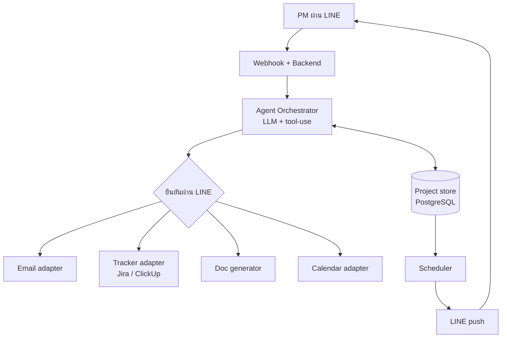
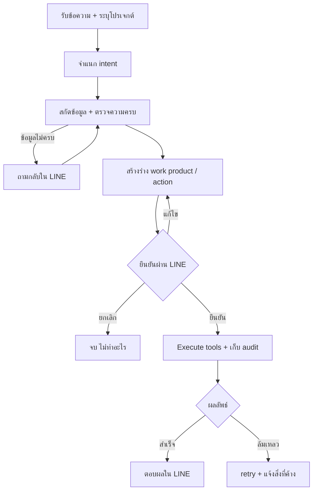
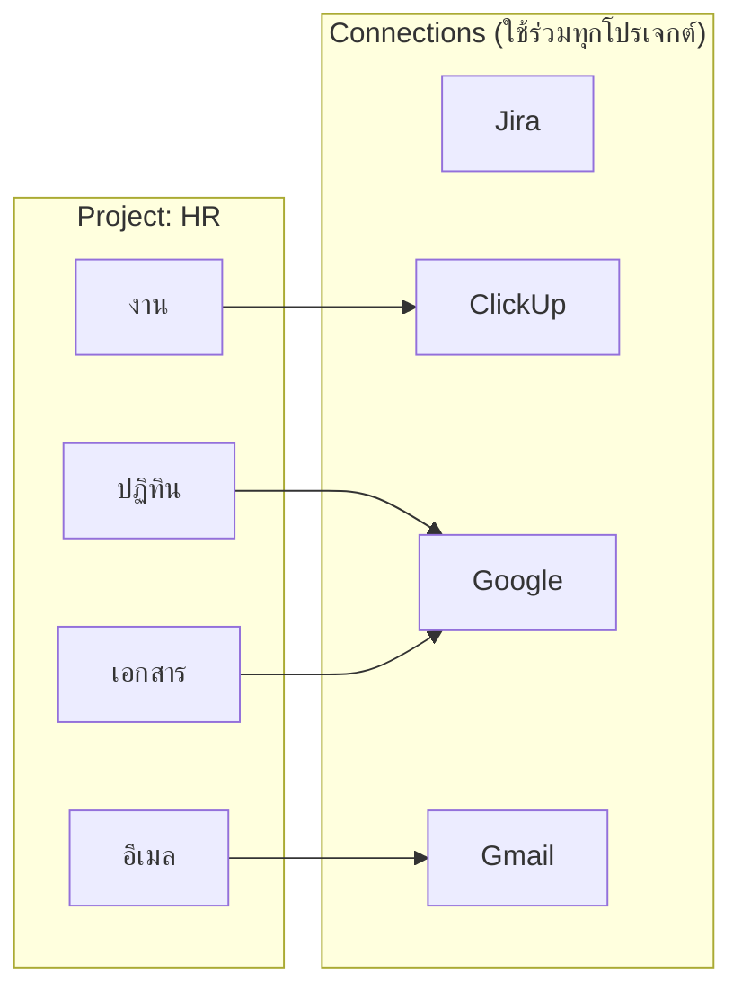
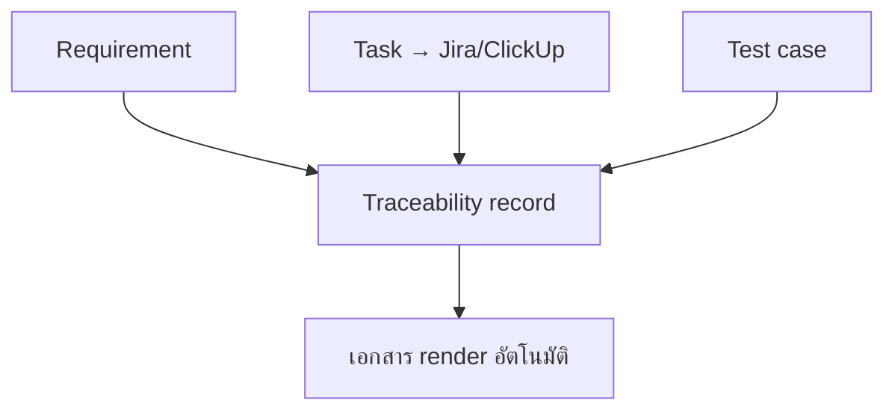

# PM Assistant — Design Specification

ผู้ช่วย AI สำหรับ IT Project Manager ทำงานผ่าน LINE: เปลี่ยนเนื้อหาประชุมเป็นเอกสาร work product ตาม ISO 29110, เปิดงานเข้า Jira/ClickUp, จัดการนัดหมาย Google Calendar, และแจ้งเตือนผ่าน LINE

เวอร์ชัน 1.0 · เอกสารนี้ใช้คู่กับ `schema.sql` และ `README.md`

---

## 1. ภาพรวมและขอบเขต

### 1.1 วัตถุประสงค์
ลดงานเอกสารและงานประสานของ PM โดยให้พิมพ์/พูดเป็นภาษาธรรมชาติใน LINE แล้วระบบช่วยจัดการให้อัตโนมัติ พร้อมคงมาตรฐานเอกสารตาม ISO 29110 (Basic Profile สำหรับ Very Small Entity)

### 1.2 ในขอบเขต
- สรุปประชุมเป็น Meeting Record + ส่งอีเมลผู้เกี่ยวข้อง
- ลงงานเข้า Project Plan และเปิด card บนระบบจัดการงาน (รองรับหลายแพลตฟอร์ม)
- สร้าง/ผูก milestone, สร้างนัดหมายปฏิทินแบบประจำ + ลิงก์ประชุม
- ถาม-ตอบสถานะงาน/ประชุม, แจ้งเตือนใกล้ครบกำหนด/ใกล้ประชุม
- จัดการ requirement / test case / traceability
- เลขรันเอกสารแยกต่อโครงการ, คลังเอกสาร

### 1.3 นอกขอบเขต (เวอร์ชันแรก)
- การวิเคราะห์/พยากรณ์งานเชิงลึก, การจัดการงบประมาณ, การทำ resource leveling
- รองรับช่องทางอื่นนอกเหนือจาก LINE

### 1.4 มาตรฐานอ้างอิง — ISO/IEC 29110
แมป intent ของผู้ใช้เข้ากับ work product จริง:

| ผู้ใช้ทำอะไร | Work product (PM/SI process) |
|---|---|
| สรุปประชุม | Meeting Record |
| ลงงาน / อัปเดตสถานะ | Project Plan, Progress Status Record |
| เปลี่ยน scope | Change Request |
| ระบุความต้องการ | Requirements Specification |
| ผูก req ↔ งาน ↔ test | Traceability Record |
| เพิ่มกรณีทดสอบ | Test Cases |

---

## 2. สถาปัตยกรรมระบบ

### 2.1 หลักการ
- **Ports & adapters** — core ทำงานกับ canonical model เท่านั้น ไม่รู้จักแพลตฟอร์มปลายทางโดยตรง การต่อ Jira/ClickUp/Google เป็นแค่ adapter ที่สลับได้
- **Two surfaces** — แชท LINE สำหรับงานรายวัน, หน้าเว็บ LIFF สำหรับตั้งค่า/จัดการ
- **Human-in-the-loop** — ทุก action ที่มีผลจริงต้องผ่านการยืนยันก่อนเสมอ

### 2.2 องค์ประกอบ

- **Webhook + Backend** — รับ event จาก LINE (verify signature ก่อนเสมอ)
- **Agent Orchestrator** — จำแนก intent, สกัดข้อมูล, สร้างร่าง, route ไป tool
- **Adapters** — Email, Tracker (Jira/ClickUp), Doc generator, Calendar, Notifier
- **Project store** — PostgreSQL เก็บ state ทั้งหมด (ดู §6)
- **Scheduler** — งานเบื้องหลังเช็ก due date/ประชุม แล้ว push เตือน

---

## 3. Flow การทำงาน

### 3.1 Core request lifecycle
ทุกข้อความวิ่งผ่านเส้นทางเดียวกัน:

ร่างมี timeout (เช่น 30 นาที) เพื่อกันการยืนยันร่างเก่าที่ข้อมูลเปลี่ยนไปแล้ว

### 3.2 เคสหลัก
- **ประชุม → memo:** สกัดผู้เข้าร่วม/มติ/action item (พร้อม flag สิ่งที่ระบบเดา) → Meeting Record + ร่าง memo → ยืนยัน → ส่งเมล + เก็บใน repository
- **ลงงาน → plan + card:** สกัด task/ผู้รับ/due/priority → map ลง Project Plan + field ของ tracker → ยืนยัน → อัปเดต plan + เปิด card (มี idempotency key กัน card ซ้ำ)
- **นัดหมาย:** สกัดเวลา/ความถี่/ผู้เข้าร่วม → สร้าง event + RRULE + Google Meet link → ยืนยัน → สร้างใน Calendar + ส่ง invite อัตโนมัติ
- **query:** อ่านจาก store + แพลตฟอร์ม → ตอบเป็นรายการ (ไฮไลต์งานเลยกำหนด)
- **milestone:** สร้าง record + ผูก task เข้ากับ milestone

---

## 4. โมเดลหลายแพลตฟอร์ม

แยก **connection** (บัญชีที่ authenticate ไว้) ออกจาก **binding** (โปรเจกต์เลือกใช้ connection ไหนต่อ capability) เด็ดขาด

ข้อดี: เชื่อมบัญชีครั้งเดียวใช้ได้หลายโปรเจกต์, หนึ่งแพลตฟอร์มให้หลาย capability (Google = ปฏิทิน+เอกสาร+เมล), และเพิ่มแพลตฟอร์มใหม่ = เขียน adapter ตัวเดียวโดยไม่แตะ core

ข้อควรระวัง: แต่ละแพลตฟอร์มมี field ต่างกัน → adapter รับหน้าที่แปลง canonical model เป็นศัพท์ของแพลตฟอร์มนั้น และเก็บ mapping config แยกต่อ binding; เมื่อ token หมดอายุให้เด้ง re-auth โดยไม่กระทบ binding

---

## 5. เทมเพลตเอกสารและเลขรัน

### 5.1 เทมเพลต
- ไฟล์ `.docx` ที่ฝัง placeholder (แนะนำ `docxtpl` ใช้ไวยากรณ์ Jinja2 ในไฟล์ Word)
- อัปโหลดแยกต่อโครงการต่อ work product ผ่านหน้า LIFF
- คนที่ไม่ใช่ dev แก้ถ้อยคำ/โลโก้เองได้ตราบใดที่ไม่ลบ placeholder
- ระบบเติมข้อมูลลงช่อง ไม่ generate เอกสารทั้งใบ เพื่อคุมรูปแบบให้ตรง ISO

### 5.2 เลขรันเอกสาร (ต่อโครงการ)
- รูปแบบกำหนดได้ เช่น `{KEY}-{TYPE}-{SEQ:04d}` → `HR-MIN-0007`
- ตัวนับแยกต่อโครงการต่อชนิดเอกสาร, เลือกรีเซ็ตรายปีได้
- ออกเลขแบบ atomic ใน transaction (กันเลขชน — ดู `README.md`)

---

## 6. Data model

ใช้ PostgreSQL (deploy บน Railway) รายละเอียดเต็มใน `schema.sql` (23 ตาราง) สรุปตามกลุ่ม:

| กลุ่ม | ตารางหลัก | หน้าที่ |
|---|---|---|
| Identity & projects | `users`, `projects`, `project_members`, `line_contexts` | ระบุผู้ใช้/โปรเจกต์/ผูกแชทกับโปรเจกต์ |
| Multi-platform | `connections`, `project_bindings` | บัญชีที่เชื่อม + ปลายทางต่อ capability |
| Documents | `document_templates`, `document_number_sequences`, `documents` | เทมเพลต/เลขรัน/เอกสารที่ออก |
| Meetings | `meetings`, `meeting_attendees`, `action_items` | บันทึกประชุม + action item |
| Delivery | `milestones`, `tasks` | milestone + งาน (มี `external_ref` ชี้ card) |
| ISO SI | `requirements`, `test_cases`, `traceability_links` | traceability matrix |
| Calendar | `calendar_events`, `calendar_event_attendees` | นัดหมาย + ผู้เข้าร่วม |
| Confirmation | `pending_confirmations` | flow ยืนยัน (มี `expires_at`) |
| Notifications | `notification_preferences`, `scheduled_notifications` | คิวแจ้งเตือน + พรีเซ็ตผู้ใช้ |
| Audit | `audit_log` | บันทึกใครทำอะไร (ISO) |

### 6.1 Traceability

แต่ละ link เชื่อม requirement เข้ากับ task (implements) หรือ test case (verifies) เอกสาร Traceability/Test Case render จากข้อมูลชุดเดียวกัน ทำให้ไม่มีทางหลุดไม่ตรงกัน

---

## 7. รายการหน้าจอ

### 7.1 ฝั่งแชท LINE
| # | หน้าจอ | หน้าที่ |
|---|---|---|
| C1 | ต้อนรับครั้งแรก | แนะนำตัว + ปุ่มตั้งค่าโปรเจกต์แรก |
| C2 | สรุปประชุม | ร่าง Meeting Record + quick reply ยืนยันส่งเมล |
| C3 | ลงงาน | ร่าง task + ช่องปลายทาง + quick reply |
| C4 | ถาม-ตอบ | รายการงานค้าง/ประชุม (ไฮไลต์เลยกำหนด) |
| C5 | milestone | ร่าง milestone + ผูกงาน |
| C6 | นัดหมาย | ร่าง event ประจำ + Meet link |
| C7 | แจ้งเตือน (push) | เตือนก่อนประชุม + ปุ่มเข้าร่วม |
| C8 | rich menu | เมนูค้าง: เลือกโปรเจกต์/สรุปประชุม/เพิ่มงาน/งานค้าง/ออกเอกสาร/ช่วยเหลือ |
| C9 | สถานะตอบกลับ | สำเร็จ / ทำได้บางส่วน / ถามกลับ |

### 7.2 ฝั่งเว็บตั้งค่า (LIFF)
| # | หน้าจอ | หน้าที่ |
|---|---|---|
| W1 | สลับโปรเจกต์ | เลือก/สร้างโปรเจกต์ |
| W2 | แดชบอร์ด | ภาพรวม: สถิติงาน, milestone, งานใกล้ครบ, ประชุมถัดไป |
| W3 | สมาชิก | จัดการชื่อ/อีเมล/บทบาท |
| W4 | เชื่อมต่อแพลตฟอร์ม | เพิ่ม connection ผ่าน OAuth |
| W5 | ปลายทาง + เทมเพลต | route capability + อัปโหลดเทมเพลต |
| W6 | เลขเอกสาร | รูปแบบ + ตัวนับต่อชนิด |
| W7 | การแจ้งเตือน | เปิด/ปิดชนิด + ช่วงงดรบกวน |
| W8 | คลังเอกสาร | เรียกดูเอกสารที่ออกพร้อมเลขรัน |
| W9 | traceability | ความครอบคลุม req ↔ task ↔ test |

หลักการ UX: หน้าตั้งค่าใช้ pattern เดียวกัน (header + bordered rows) เปิดจาก rich menu; การ์ดร่างแสดงข้อมูลครบและไฮไลต์สิ่งที่ระบบเดาก่อนทำจริง; ปุ่ม quick reply ทำให้ยืนยัน/แก้/ยกเลิกได้ด้วยการแตะครั้งเดียว

---

## 8. Functional requirements

| ID | รายละเอียด |
|---|---|
| FR-01 | รับข้อความ/เสียงจาก LINE และระบุโปรเจกต์ที่เกี่ยวข้อง |
| FR-02 | จำแนก intent ของผู้ใช้ และถามกลับเมื่อกำกวม |
| FR-03 | สกัดข้อมูลมีโครงสร้างตาม schema และถามกลับเมื่อข้อมูลไม่ครบ |
| FR-04 | สร้างร่าง work product จากเทมเพลตของโครงการ |
| FR-05 | แสดงร่างให้ยืนยันก่อน execute เสมอ พร้อม timeout |
| FR-06 | สรุปประชุมเป็น Meeting Record และส่งอีเมลผู้เกี่ยวข้อง |
| FR-07 | ลงงานเข้า Project Plan และเปิด card บน tracker ที่ผูกไว้ |
| FR-08 | สร้าง milestone และผูก task เข้ากับ milestone |
| FR-09 | สร้างนัดหมาย Google Calendar (recurrence + Meet link + invite) |
| FR-10 | ตอบคำถามสถานะ: งานค้าง, ประชุม, กำหนดส่ง |
| FR-11 | แจ้งเตือน due/overdue/ใกล้ประชุม ผ่าน LINE push |
| FR-12 | จัดการ requirement, test case และ traceability |
| FR-13 | ออกเลขรันเอกสารแยกต่อโครงการ (รีเซ็ตรายปีได้) |
| FR-14 | คลังเอกสาร: เรียกดู/ดาวน์โหลดเอกสารที่ออก |
| FR-15 | รองรับหลาย connection และ binding ต่อ capability ต่อโครงการ |
| FR-16 | อัปโหลด/จัดการเทมเพลตต่อโครงการ |
| FR-17 | จัดการสมาชิกโครงการ (ชื่อ/อีเมล/บทบาท) |
| FR-18 | ตั้งค่าชนิดการแจ้งเตือนและช่วงงดรบกวน |
| FR-19 | บันทึก audit log ทุก action ที่มีผล |

---

## 9. Non-functional requirements

| ID | รายละเอียด |
|---|---|
| NFR-01 | ความปลอดภัย: verify LINE signature, เข้ารหัส credential ฝั่งแอป (DB เก็บ ciphertext) |
| NFR-02 | idempotency: กัน card/อีเมลซ้ำเมื่อ webhook retry หรือกดยืนยันซ้ำ |
| NFR-03 | ออกเลขเอกสารแบบ atomic ใน transaction |
| NFR-04 | privacy: เนื้อหาประชุมอาจเป็นข้อมูลลับลูกค้า ต้องจำกัดการเข้าถึง |
| NFR-05 | จัดการโควตา LINE push (รวมเตือนต่อวัน, เคารพช่วงงดรบกวน) |
| NFR-06 | auditability: ทุก action ตรวจย้อนได้ (รองรับ ISO) |
| NFR-07 | extensibility: เพิ่ม adapter ใหม่โดยไม่แก้ core |
| NFR-08 | error handling: retry แบบ backoff และรายงานสถานะบางส่วนเมื่อล้มเหลว |
| NFR-09 | re-auth flow เมื่อ token ของ connection หมดอายุ |
| NFR-10 | timezone: ดีฟอลต์ Asia/Bangkok และคำนวณเวลาเตือนตาม timezone ผู้ใช้ |

---

## 10. Tech stack และ deployment

- **Backend:** Python + FastAPI (public HTTPS สำหรับ LINE webhook)
- **LLM:** โมเดลที่รองรับ tool-use / function calling
- **เอกสาร:** `docxtpl` สำหรับ template, object storage สำหรับไฟล์
- **ฐานข้อมูล:** PostgreSQL บน Railway (`schema.sql`)
- **Scheduler:** worker/cron (เช่น APScheduler) สำหรับแจ้งเตือน
- **Front-end:** LINE Messaging API (Flex Message, quick reply, rich menu) + LIFF สำหรับหน้าตั้งค่า
- **Auth:** OAuth สำหรับ Google/Jira/ClickUp, API token ที่รองรับ
- **Dev:** ngrok สำหรับเปิด webhook ตอนพัฒนา

โครงโฟลเดอร์ (ดูรายละเอียดใน README ก่อนหน้า): `core/`, `ports/`, `adapters/`, `templates/`, `channels/`, `config.yaml`, `.env`

---

## 11. แผนพัฒนาเป็นเฟส

| เฟส | เป้าหมาย |
|---|---|
| 0 | ตั้ง repo + FastAPI + LINE channel + DB schema |
| 1 (MVP) | ประชุม → memo → เมล โดยใช้ `mock_tracker` (demo ได้ครบ flow โดยไม่ต้องต่อระบบจริง) |
| 2 | adapter จริงตัวแรก (Jira หรือ ClickUp) + email + calendar |
| 3 | query, milestone, แจ้งเตือน (scheduler + push) |
| 4 | requirement/test/traceability, multi-platform UI, คลังเอกสาร |

จุดแข็งของลำดับนี้: พิสูจน์ระบบได้เต็มที่ตั้งแต่เฟส 1 โดยยังไม่ต้องรู้ว่าบริษัทปลายทางใช้แพลตฟอร์มอะไร

---

## 12. ความเสี่ยงและการรับมือ

| ความเสี่ยง | การรับมือ |
|---|---|
| LLM สร้าง action item ที่ไม่มีจริง | บังคับแสดงร่างยืนยันเสมอ + flag สิ่งที่ระบบเดา |
| field แต่ละแพลตฟอร์มต่างกัน | mapping config แยกต่อ adapter/connection |
| โควตา push เต็ม | รวมเตือน, ตั้ง preference, เคารพช่วงงดรบกวน |
| token หมดอายุกลางคัน | จับ error → เด้ง re-auth โดยไม่กระทบ binding |
| scope creep | ยึดแผนเป็นเฟส, MVP ก่อน |

---

## 13. อภิธานศัพท์

- **Work product** — เอกสาร/ผลงานที่ ISO 29110 กำหนด
- **Connection** — บัญชีแพลตฟอร์มที่ authenticate ไว้
- **Binding** — การที่โครงการเลือก connection สำหรับ capability หนึ่ง
- **Capability** — ความสามารถที่ route ได้: tasks / calendar / docs / email / notify
- **LIFF** — LINE Front-end Framework สำหรับฝังหน้าเว็บใน LINE
- **HITL** — Human-in-the-loop, ยืนยันก่อนระบบทำจริง
